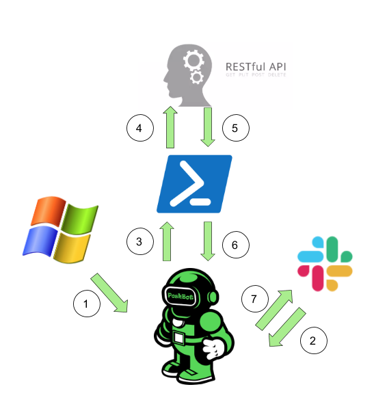

# Cohesity Poshbot 
# Overview

1. Set up configuration of Poshbot on Windows environment 
2. Commands get sent to Poshbot from slack
3. Commands are excecuted in Powershell 
4. REST API calls made through Cohesity Powershell module
5. Powershell output recieved by using Cohesity Powershell module 
6. Output is created in Poshbot as a custom response
7. Output is formatted and is displayed in Slack through Poshbot call

# Get Started 
Link to how to setup and get Poshbot running 
* [Quick Start Guide](/cohesity-module-for-poshbot/PoshBot.Cohesity/public/README.md)

# Use Cases 
Cohesity Poshbot can be used to : 
* Get active Cohesity protection jobs
* Get Cohesity alerts 
* Get Cohesity cluster status 
* Create Cohesity protection job 
* Output Cohesity protection runs graph
* Get Cohesity resolved alerts 
* Resume Cohesity job
* Stop Cohesity job
* Start Cohesity job 
* Resolve Cohesity alerts 
